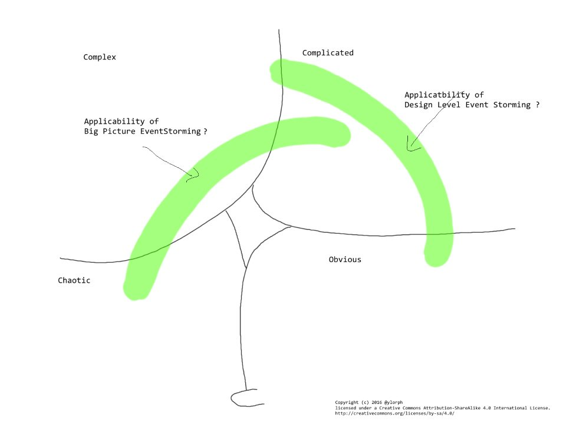

# Random thoughts on Domain Driven Design , EventStorming & Cynefin Part II
please read the disclaimer I made in [part I](./2016.02.21.DDD_EventStorming_Cynefin.part.01.md)  
Basically, Cynefin is new to me and I'm trying to make sense of it in relation to, for now, EventStorming

Cynefin is a model and a set of practices that, as far as I understand, is meant to help decision  making on an organizational level.
It also is a way to achieve changes in organization.

The practices seems to have the  following properties
* be oblique
* avoid groupthink
* use stories
* participative
* context / sharing
* Emphasis on what then situation is _then_ change it
* find the **most important problem**
* invalidating ideas
* breaking down silos

An EventStorming session, by definition,
* breaks down barriers & silos
* has narrative & stories & anecdotes
* is participative
* ...

An EventStorming session going well,
especially a big picture one, will probably result in lot's of explicit unknowns and problems.  
And, hopefully, in finding the real problem that need solving, the bottleneck.

Those certainly could be mapped on a Cynefin domain.   
This might help to decide what need to be furthered explored, or broken down (Complex -> Complicated)    
It will also uncover what parts of the organization and the people who are  impacted and so help find out what & who can define the criteria for positive progress and improvements.

## Cynefin and EventStorming

[TODO: I really should draw that differently...]

### Obvious
[TODO ...a sessions explore  the relation of the obvious to the rest, even in Big picture EventStorming ???]

### Complicated
A Big picture Event Storming to explore different ideas and dismiss them or keep them for further exploration as fast as possible.

More probably a set of Design level sessions.  
They allow quick exploration of different ideas.  
We can engage very specific people.  
We should prototype fast for rapid feedback.

#### Complex
[TODO well, we do get the whole picture , in all it's complexity.
The whole is bigger than the sum of the parts....]

#### Chaotic
_chaotic for me = we're in a real mess_  
I wouldn't EventStorm when in Chaotic mode.  
Chaotic mode is a call for action. Not for analysis.  
Using EventStorming to _retrospectively_ analyze what happened , yes definitively.  
Certainly because it is a group exercise and that we can explore different path and avoid groupthink

#### Differentiating between ordered & unordered
An EventStorming session could help here:   
Where we have lot's of scenarios, orange stickies, all coming easily: I feel that this could be in the ordered part of Cynefin (Complicated or Obvious)

Where the scenarios are difficult, the events on the  stickies are hard to find, lot's of different path, discussions, ...
Probably Unordered domain (Complex / Chaotic)

## Some Quick References

Cynefin:   
[Cognitive Edge](http://cognitive-edge.com/)  
[InfoQ Cynefin mini book](http://www.infoq.com/minibooks/cynefin-mini-book)  
[A Leader’s Framework for Decision Making](https://hbr.org/2007/11/a-leaders-framework-for-decision-making)

EventStorming :  
[Community](https://plus.google.com/communities/113258571348605620818)  
[The book](https://leanpub.com/introducing_eventstorming)
