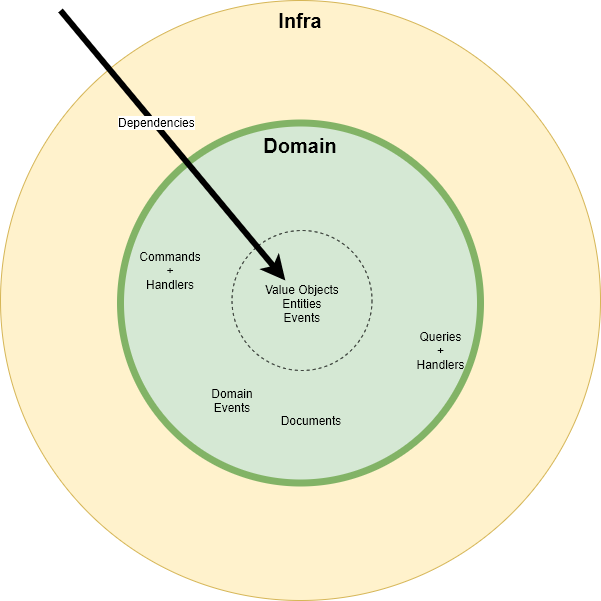

- Command: 
  - Message to change the state of the system. 
  - Side effects 
  - System may refuse to act on it
- Query: 
  - Message to get information from the system
  - No side effects.
  - System may refuse to answer
- Event: 
  - message that something changed in some part of the system.
  - System may  not deny the fact
  - System may ignore it.

The message exchange patterns could be request/response or one way
( publish-subscribe, fan in - fan out, push - pull, ...)
The message exchange medium can be durable or not
( durable queue , in mem queue, .... )

 
