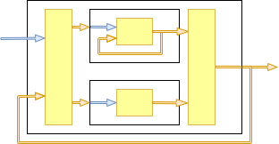

# An Opinion on Systems And EventSourced  BLOBAs Systems

_LOBAs_ :**B**oring **L**ine **O**f **B**usiness **A**pplications

## Systems

There are all sort of systems.

The first ones I had to study in a real abstract way were electronic & signal processing systems.

This has biased me into abstracting solutions to problems into  a series of components. 
Each component has a specific function with _inputs_, _outputs_, a process (some _function_) and eventually a _feedback loop_.

Except when building or troubleshooting the internals of the component, you don't really care what and how it really works.
You only need _inputs_, _outputs_ and some _function_, describing accurately enough,how one signal is transformed into another.

Those components are then assembled together, the output of one becoming the input of the other, to form a more complex system exhibiting more interesting behaviors.  
That resulting composition then becomes a new components that has a specific function with _inputs_, _outputs_, a process (some _function_) and eventually a _feedback loop_.

That new more complex component can then be reasoned about without necessarily needing to understand its internal structure.

